# Roo Code クラス図

このドキュメントでは、Roo Code の主要なクラスとその関係を mermaid 記法で図示します。

## 全体のクラス図


## コアモジュールのクラス図

```mermaid
classDiagram
    Cline --> ApiHandler : uses
    Cline --> TerminalManager : uses
    Cline --> BrowserSession : uses
    Cline --> DiffViewProvider : uses
    Cline --> CheckpointService : uses
    Cline --> McpHub : uses
    
    class Cline {
        +taskId: string
        +api: ApiHandler
        +terminalManager: TerminalManager
        +browserSession: BrowserSession
        +diffViewProvider: DiffViewProvider
        +apiConversationHistory: MessageParam[]
        +clineMessages: ClineMessage[]
        +checkpointsEnabled: boolean
        +diffEnabled: boolean
        +startTask(task?: string, images?: string[])
        +resumeTaskFromHistory()
        +initiateTaskLoop(userContent: UserContent)
        +recursivelyMakeClineRequests(userContent: UserContent)
        +abortTask(isAbandoned: boolean)
        +ask(type: ClineAsk, text?: string, partial?: boolean)
        +say(type: ClineSay, text?: string, images?: string[], partial?: boolean)
        +presentAssistantMessage()
        +executeCommandTool(command: string)
        +attemptApiRequest(previousApiReqIndex: number, retryAttempt: number)
        +checkpointSave(options: { isFirst: boolean })
        +checkpointRestore(options: { ts: number, commitHash: string, mode: string })
        +checkpointDiff(options: { ts: number, commitHash: string, mode: string })
    }
    
    class ApiHandler {
        <<interface>>
        +getModel(): Model
        +createMessage(systemPrompt: string, history: MessageParam[])
    }
    
    class TerminalManager {
        -terminals: Map<number, TerminalInfo>
        +getOrCreateTerminal(cwd: string)
        +runCommand(terminalInfo: TerminalInfo, command: string)
        +getUnretrievedOutput(terminalId: number)
        +disposeAll()
    }
    
    class BrowserSession {
        -browser: Browser
        -page: Page
        +launchBrowser()
        +navigateToUrl(url: string)
        +click(coordinate: string)
        +type(text: string)
        +closeBrowser()
    }
    
    class DiffViewProvider {
        -cwd: string
        -editor: TextEditor
        -originalContent: string
        -editType: "create" | "modify"
        +open(relPath: string)
        +update(content: string, isComplete: boolean)
        +saveChanges()
        +revertChanges()
        +reset()
    }
    
    class CheckpointService {
        <<interface>>
        +saveCheckpoint(message: string)
        +restoreCheckpoint(commitHash: string)
        +getDiff(options: DiffOptions)
    }
    
    class McpHub {
        -servers: Map<string, McpServerConnection>
        -serverConfigs: Record<string, McpServerConfig>
        +initialize(serverConfigs: Record<string, McpServerConfig>)
        +startServer(name: string)
        +stopServer(name: string)
        +callTool(serverName: string, toolName: string, args?: Record<string, unknown>)
        +readResource(serverName: string, uri: string)
    }
```

## API プロバイダーのクラス図

```mermaid
classDiagram
    ApiHandler <|-- AnthropicProvider : implements
    ApiHandler <|-- OpenAIProvider : implements
    ApiHandler <|-- GeminiProvider : implements
    ApiHandler <|-- BedrockProvider : implements
    ApiHandler <|-- MistralProvider : implements
    ApiHandler <|-- OllamaProvider : implements
    ApiHandler <|-- OpenRouterProvider : implements
    
    class ApiHandler {
        <<interface>>
        +getModel(): Model
        +createMessage(systemPrompt: string, history: MessageParam[])
    }
    
    class AnthropicProvider {
        -client: Anthropic
        -model: Model
        +getModel(): Model
        +createMessage(systemPrompt: string, history: MessageParam[])
    }
    
    class OpenAIProvider {
        -client: OpenAI
        -model: Model
        +getModel(): Model
        +createMessage(systemPrompt: string, history: MessageParam[])
    }
    
    class GeminiProvider {
        -client: GoogleGenerativeAI
        -model: Model
        +getModel(): Model
        +createMessage(systemPrompt: string, history: MessageParam[])
    }
    
    class BedrockProvider {
        -client: BedrockRuntimeClient
        -model: Model
        +getModel(): Model
        +createMessage(systemPrompt: string, history: MessageParam[])
    }
    
    class MistralProvider {
        -client: MistralClient
        -model: Model
        +getModel(): Model
        +createMessage(systemPrompt: string, history: MessageParam[])
    }
    
    class OllamaProvider {
        -baseURL: string
        -model: Model
        +getModel(): Model
        +createMessage(systemPrompt: string, history: MessageParam[])
    }
    
    class OpenRouterProvider {
        -client: OpenAI
        -model: Model
        +getModel(): Model
        +createMessage(systemPrompt: string, history: MessageParam[])
    }
```



## MCP 関連のクラス図


## チェックポイント関連のクラス図


## ウェブビュー関連のクラス図


これらのクラス図は、Roo Code の主要なクラスとその関係を示しています。実際のコードベースはさらに複雑ですが、これらの図は全体的な構造を理解するのに役立ちます。