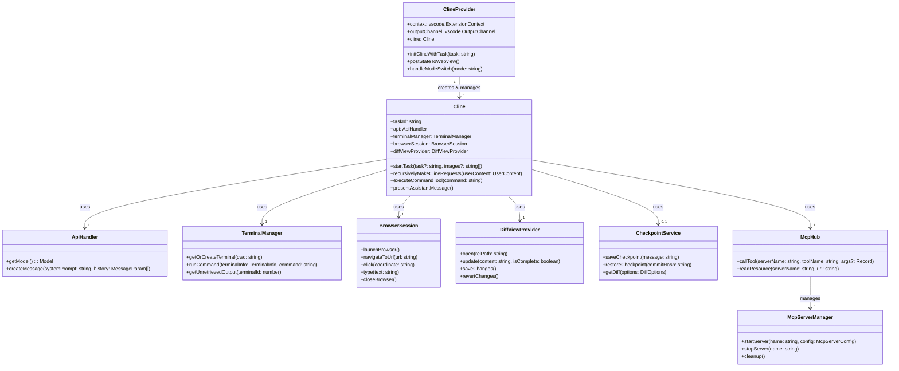

# Roo Code コアクラス構造

このドキュメントでは、Roo Code の主要なクラスとその関係について説明します。

## 主要クラス

### ClineProvider

`src/core/webview/ClineProvider.ts` に定義されています。

VSCode のウェブビュープロバイダーを実装したクラスで、拡張機能のメインビューを提供します。Cline インスタンスを管理し、ウェブビューとの通信を担当します。

主な責務:
- ウェブビューの初期化と管理
- Cline インスタンスの作成と管理
- ウェブビューとの通信
- タスク履歴の管理
- 設定の管理

### Cline

`src/core/Cline.ts` に定義されています。

拡張機能のコア機能を実装するクラスで、AI モデルとの通信、ツールの実行、メッセージの管理などを担当します。

主な責務:
- AI モデルとの通信
- ツールの実行（ファイル操作、コマンド実行など）
- メッセージの管理
- タスクの実行と管理
- チェックポイント機能

### ApiHandler

`src/api/index.ts` で定義されているインターフェースです。

AI プロバイダー（Anthropic, OpenAI など）との通信を抽象化するインターフェースです。

主な責務:
- AI モデルとの通信
- メッセージのストリーミング
- モデル情報の提供

### McpServerManager

`src/services/mcp/McpServerManager.ts` に定義されています。

Model Context Protocol (MCP) サーバーを管理するクラスです。

主な責務:
- MCP サーバーの起動と停止
- サーバー設定の管理
- サーバーとの通信

### DiffViewProvider

`src/integrations/editor/DiffViewProvider.ts` に定義されています。

差分ビューを提供するクラスです。ファイルの変更を表示し、編集を管理します。

主な責務:
- 差分ビューの表示
- ファイル編集の管理
- 変更の適用と取り消し

### TerminalManager

`src/integrations/terminal/TerminalManager.ts` に定義されています。

ターミナルを管理するクラスです。コマンドの実行と出力の取得を担当します。

主な責務:
- ターミナルの作成と管理
- コマンドの実行
- 出力の取得

### BrowserSession

`src/services/browser/BrowserSession.ts` に定義されています。

ブラウザセッションを管理するクラスです。Puppeteer を使用してブラウザを制御します。

主な責務:
- ブラウザの起動と停止
- ページの操作（クリック、スクロールなど）
- スクリーンショットの取得
- コンソールログの取得

### CheckpointService

`src/services/checkpoints/CheckpointServiceFactory.ts` で作成されるサービスです。

チェックポイント機能を提供するサービスです。ファイルの変更を記録し、復元する機能を提供します。

主な責務:
- チェックポイントの作成
- チェックポイントの復元
- 差分の取得

## クラス間の関係

## 主要なデータフロー

1. **拡張機能の起動**:
   - `extension.ts` の `activate` 関数が呼び出される
   - `ClineProvider` が作成され、サイドバーに登録される
   - コマンド、コードアクション、ターミナルアクションが登録される

2. **タスクの実行**:
   - ユーザーがタスクを入力する
   - `ClineProvider` が `Cline` インスタンスを作成
   - `Cline` が `ApiHandler` を使用して AI モデルと通信
   - AI モデルからのレスポンスが解析され、ツールが実行される
   - 結果がユーザーに表示される

3. **ツールの実行**:
   - `Cline` がツールを実行（ファイル操作、コマンド実行など）
   - 結果が AI モデルに返される
   - AI モデルが次のステップを決定

4. **チェックポイント機能**:
   - `Cline` が `CheckpointService` を使用してチェックポイントを作成
   - ユーザーがチェックポイントを復元できる

5. **MCP サーバー**:
   - `McpHub` が `McpServerManager` を使用して MCP サーバーを管理
   - `Cline` が `McpHub` を使用してツールを実行